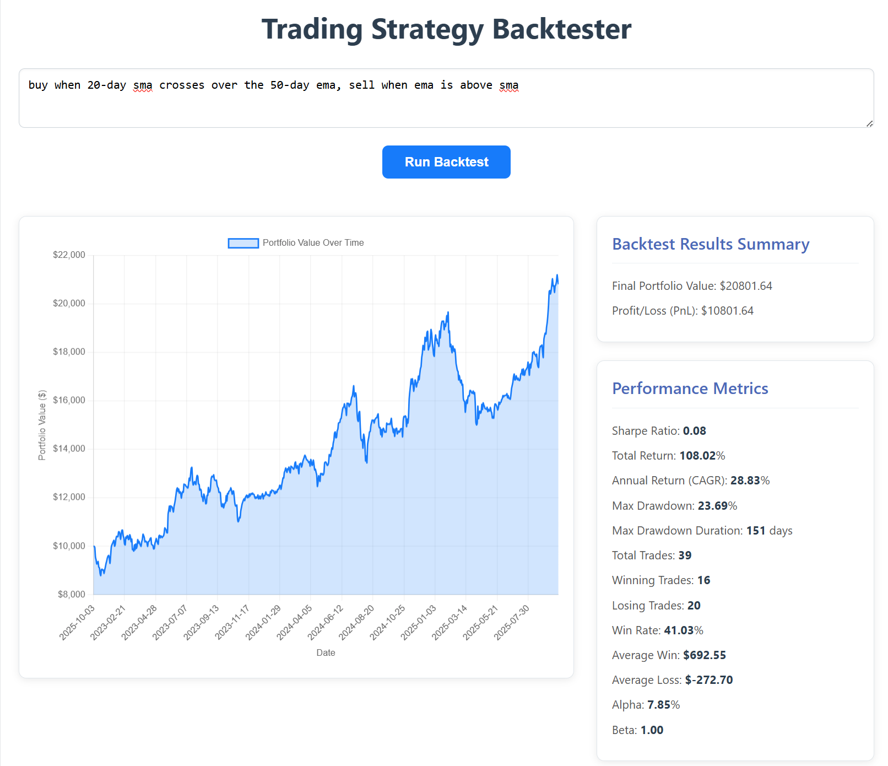

# Natural Language Trading Strategy Backtester

An intelligent web application that translates trading strategies written in plain English into a quantitative backtest, providing comprehensive performance metrics and an interactive equity curve.



---

## 📖 Table of Contents
- [About The Project](#-about-the-project)
- [Key Features](#-key-features)
- [How It Works](#-how-it-works)
- [Technology Stack](#-technology-stack)
- [Getting Started](#-getting-started)
  - [Prerequisites](#prerequisites)
  - [Installation](#installation)
  - [Usage](#usage)
- [Project Structure](#-project-structure)
- [Future Improvements](#-future-improvements)
- [License](#-license)

---

## 🌟 About The Project
This project bridges the gap between complex trading ideas and quantitative analysis. Instead of writing intricate code to test a strategy, users can simply describe it in plain English.  

The application leverages a **Large Language Model (Google Gemini)** to parse the user's intent, constructs a dynamic strategy, and runs a rigorous backtest against historical market data using the **Backtrader** framework.  

The goal is to empower traders and analysts to **rapidly iterate on their ideas** without the friction of programming, providing instant feedback on a strategy's historical performance.

---

## ✨ Key Features
- **Natural Language Processing**: Describe your strategy in English (e.g., *"Buy when the 20-day SMA crosses above the 50-day EMA"*).  
- **Dynamic Strategy Generation**: The backend dynamically configures indicators and trading rules from LLM output.  
- **Comprehensive Performance Metrics**: Includes Sharpe Ratio, Max Drawdown, Alpha, Beta, Win Rate, and more.  
- **Interactive Equity Curve**: Visualize your portfolio’s value over time with **Chart.js**.  
- **Multi-Asset Universe**: Backtests run on a predefined basket of 25 popular stocks and ETFs.  
- **Risk Management Built-In**: Trades sized by fixed portfolio risk and ATR-based volatility.  
- **Responsive Web Interface**: Modern UI for desktop and mobile.  

---

## 🛠️ How It Works
1. **Frontend (UI)**: User types a strategy and clicks *Run Backtest*.  
2. **Backend (Flask)**: Handles the `/backtest` request.  
3. **LLM Parser (`llm_parser.py`)**: Sends the natural language input to Google Gemini with a structured prompt.  
4. **JSON Strategy Config**: Gemini returns JSON defining indicators and buy/sell rules.  
5. **Backtesting Engine (`backtest.py`)**: Runs strategy in **Backtrader** with historical data from `yfinance`.  
6. **Performance Results**: Gathers metrics, chart data, and summary.  
7. **Frontend Update**: Displays results dynamically with charts and statistics.  

---

## 💻 Technology Stack
- **Backend**: Python, Flask  
- **Backtesting Engine**: Backtrader  
- **Data Source**: yfinance  
- **LLM**: Google Gemini  
- **Frontend**:  
  - HTML5, CSS3 (CSS Grid)  
  - JavaScript (ES6+)  
  - Charting: Chart.js  

---

## 🚀 Getting Started

### Prerequisites
- Python 3.8+  
- pip (Python package manager)  
- Google API Key for **Gemini** (get one from [Google AI Studio](https://makersuite.google.com/))  

### Installation
```bash
# Clone the repository
git clone https://github.com/JTSmullen/MCPStrategyBacktester.git
cd MCPStrategyBacktester

# (Optional) Create a virtual environment
python -m venv venv
source venv/bin/activate  # On Windows: venv\Scripts\activate

# Install dependencies
pip install -r requirements.txt
```

Set up your API key in a `.env` file:
```env
GOOGLE_API_KEY="YOUR_API_KEY_HERE"
```

### Run the Application
```bash
flask run
```

Visit **http://127.0.0.1:5000** in your browser.  

---

## 📈 Usage
1. Navigate to the web app.  
2. Enter a strategy such as:  
   - *"Buy when the 14-day RSI is below 30, sell when above 70."*  
   - *"Go long when the price closes above the 20-day Bollinger Band, sell when below."*  
   - *"Buy when MACD crosses above signal line, sell when below."*  
3. Click **Run Backtest**.  
4. Review metrics, summary stats, and interactive chart.  

---

## 📂 Project Structure
```bash
.
├── assets/
│   └── app-screenshot.png
├── static/
│   ├── app.js
│   └── style.css
├── templates/
│   └── index.html
├── app.py
├── backtest.py
├── llm_parser.py
├── requirements.txt
└── README.md
```

---

## 🔮 Future Improvements
- Allow users to specify custom tickers and date ranges.  
- Support advanced rules: stop-loss, take-profit, and trailing stops.  
- Implement short-selling strategies.  
- Save & compare backtest runs.  
- Provide better error messages if the LLM cannot parse a strategy.  

---

## 📄 License
This project is licensed under the MIT License. See the [LICENSE](LICENSE) file for details.  
